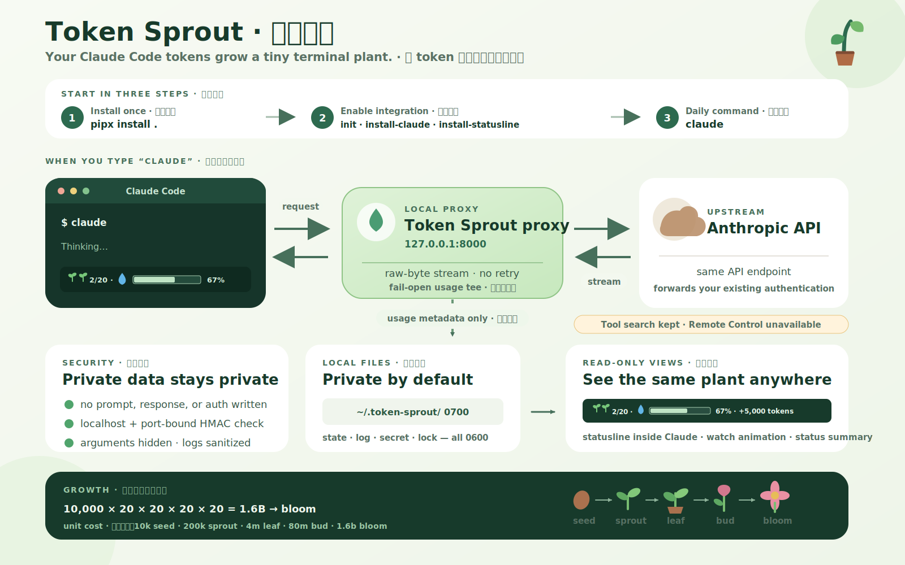

# Token Sprout 🌿

[English](README.md) | [繁體中文](README.zh-TW.md)

把你在 Claude Code 花掉的 token，養成一株終端小植物。

Token Sprout 是在本機運作的透明轉發 proxy。它只從 Anthropic API
回應讀取 token 用量資訊，再把用量變成植物成長。安裝後你照常輸入
`claude`；Claude 思考時，植物會出現在
[Claude Code 視窗底部的 status line](https://code.claude.com/docs/en/statusline)。



> **狀態：發布前版本（`0.1.0.dev0`）。** 自動測試、套件建置與本機 smoke
> test 已備妥。`v0.1.0` 前仍需人工完成：訂閱 OAuth 完整 session、實際
> Esc 中斷、直連與 proxy 的首 token 延遲比較、一天成長速度校準、WSL2
> 端到端安裝，以及最終 demo GIF。乾淨 `pipx install .` 已於 28.91 秒內
> 通過；相同的五分鐘啟動測試仍需用
> `uvx` 複驗。

## 從 GitHub 下載後安裝

### 系統需求

- macOS、Linux，或透過 WSL2 使用的 Windows 10/11
- zsh 或 bash（自動 shell 整合尚不支援 fish）
- Python 3.10 以上：`python3 --version`
- Claude Code 已安裝且可執行：`claude --version`
- 建議使用 `pipx`，避免影響系統 Python

目前尚不支援原生 Windows PowerShell 或命令提示字元。下方 WSL2 路徑已
提供給發布前使用者，但正式發布前仍需完成最後一次真實 Windows 實機檢查。

macOS 或 Linux 還沒有 `pipx` 時，請先安裝。Windows 使用者請直接跳到下方
WSL2 段落：

```bash
# macOS（Homebrew）
brew install pipx
pipx ensurepath

# Linux
python3 -m pip install --user pipx
python3 -m pipx ensurepath
```

`pipx ensurepath` 後請關閉終端再開一個新視窗。

### Windows 10/11：透過 WSL2 安裝

Claude Code、Python 與 Token Sprout 必須全部安裝在**同一個 WSL2
Linux 環境**，也要從該環境啟動。不要在 WSL 安裝 Token Sprout，卻從
Windows 啟動原生 `claude.exe`；該行程不會使用 WSL 內的 shell wrapper。

先以系統管理員身分開啟 **PowerShell** 並安裝 WSL2：

```powershell
wsl --install
```

重新開機後再開 PowerShell，確認 Ubuntu 使用 version 2：

```powershell
wsl --list --verbose
```

如果 Ubuntu 顯示 version 1，先轉換再繼續：

```powershell
wsl --set-version Ubuntu 2
```

開啟 Ubuntu 應用程式，安裝 Linux 環境需要的套件：

```bash
sudo apt update
sudo apt install -y python3 python3-venv pipx git curl
pipx ensurepath
```

關閉 Ubuntu 後再開啟，並在 **WSL 內**安裝 Claude Code：

```bash
curl -fsSL https://claude.ai/install.sh | bash
claude --version
```

下載並解壓本 repo。Windows 檔案在 WSL 內會出現於 `/mnt/c`；例如 ZIP
解壓到 Windows 的 Downloads 資料夾時，通常可以這樣進入：

```bash
cd "/mnt/c/Users/YOUR_WINDOWS_USER/Downloads/token-sprout-main"
```

請改成實際含有 `pyproject.toml` 的解壓資料夾，再繼續下方第 1、2 步。
之後所有 Token Sprout 與 `claude` 指令都必須在 WSL 內執行。私有 runtime
資料夾會是 Linux 路徑 `~/.token-sprout/`，`0700`/`0600` 權限也會正常生效。

使用 VS Code 時，請在 Windows 安裝 VS Code 與
[WSL extension](https://code.visualstudio.com/docs/remote/wsl)，然後從 WSL 專案資料夾執行
`code .`。該 VS Code 視窗後續開啟的 terminal 都會在 WSL 內運作。平台前置條件
可參考 Microsoft 的
[WSL 安裝說明](https://learn.microsoft.com/windows/wsl/install) 與 Claude Code 的
[Windows/WSL 安裝說明](https://code.claude.com/docs/en/installation)。

### 1. 下載與安裝

在 GitHub 點 **Code → Download ZIP**，解壓後，用終端進入解壓後的
repo 根目錄，也就是含有 `pyproject.toml` 的那層。

```bash
cd /path/to/downloaded/token-sprout
pipx install .
token-sprout --version
```

如果 `pipx` 選到的 Python 低於 3.10，指定新版本：

```bash
pipx install --python python3.13 .
```

### 2. 初始化並連接 Claude Code

以下三個指令只需執行一次：

```bash
token-sprout init
token-sprout install-claude
token-sprout install-statusline
```

關閉這個終端，開新終端後照常啟動 Claude：

```bash
claude
```

到這裡就完成了。Claude 消耗 token 時，底部會出現：

```text
🌱🌱 2/20 · 💧 [██████░░░░] 67% · +5,000 tokens
```

Claude 閒置時會自動隱藏這行。如果希望閒置時也保留簡潔版植物，執行
`token-sprout install-statusline --always`。Claude Code 必須信任當前
workspace 才會執行 status line 指令；安裝後互動一次或重啟 Claude Code。

## 安裝器會改動什麼？

`install-claude` 會加入一段有明確標記、可完整移除的 shell function：

- zsh：有設定 `ZDOTDIR` 時寫入 `$ZDOTDIR/.zshrc`，否則是 `~/.zshrc`
- macOS 的 bash：`~/.bash_profile`
- Linux 的 bash：`~/.bashrc`

這個 function 只儲存 `token-sprout` 與現有 Claude 執行檔的絕對路徑；不會
取代 Claude，也不會寫入 API URL 或憑證。如果已有名為 `claude` 的 alias
或 function，包含從其他檔案 `source` 進來的定義，Token Sprout 會保留它並顯示
警告。確定衝突內容後，才應使用 `--force`。

`install-statusline` 會將本專案的 command merge 進
`~/.claude/settings.json`，保留所有其他設定，並在寫入前完整自我測試。
如果已經有不屬於 Token Sprout 的 status line，它不會自動覆蓋；除非你明確
加上 `--force`。

## 日常使用

照常使用 Claude Code 即可：

```bash
claude
claude --resume
```

managed function 實際執行的是
`token-sprout run -- <Claude 絕對路徑>`。`run` 只會在這個 Claude 子行程中設定
本機 API base URL；如果你沒有自行設定 `ENABLE_TOOL_SEARCH`，它也會保持
Claude Code 的動態工具搜尋功能。有需要才啟動 localhost proxy，並只關閉它自己
啟動的 proxy。指令參數可能含有私人 prompt，因此 `run` 永遠不會把參數印在
終端上。

常用指令：

```bash
token-sprout status       # 顯示一次植物與 token 摘要
token-sprout watch        # 在另一個終端顯示動畫面板
token-sprout reset        # 確認後重新開始
```

`watch` 需要至少 44×12 的終端視窗：

```text
╭──── Token Sprout 🌿  generation 1 ────╮
│      💧            💧                 │
│           💧                          │
│ 🌱 🌱 🌱 🌱                           │
│ sprout  ·  4/20                       │
│ Thinking... (1 request in flight)     │
╰───────────── Ctrl+C to exit ─────────╯
```

### 選用的 `/plant` skill

Token 追蹤必須在 Claude 啟動時就開始；`/plant` 只是方便查看的唯讀
[Claude Code skill](https://code.claude.com/docs/en/slash-commands)。建立
`~/.claude/skills/plant/SKILL.md`，內容如下：

```markdown
---
name: plant
description: 顯示我的 Token Sprout 植物狀態
allowed-tools: Bash(token-sprout status)
---

## 目前的植物

!`token-sprout status`

請用一句友善的中文摘要上方植物狀態。
```

重啟 Claude Code 後輸入 `/plant`。這個版本使用 PATH 上的穩定指令，不會寫死
某一個 `.venv` 絕對路徑。

### 明確包裝指令或雙終端模式

shell 整合不是強制的，你隨時可以明確執行：

```bash
token-sprout run -- claude
token-sprout run --port 8100 -- claude --resume
```

除錯時也可以開兩個終端：

```bash
# 終端 1
token-sprout proxy --port 8000

# 終端 2（只對當前指令生效）
ANTHROPIC_BASE_URL=http://127.0.0.1:8000 ENABLE_TOOL_SEARCH=true claude
```

不要把 `ANTHROPIC_BASE_URL` 寫進 shell 設定檔。proxy 沒有運作時，Claude 將無法
連線。

## 成長規則

只有成功的 `POST /v1/messages` 用量會養植物：

| Usage 欄位 | 記錄 | 計入成長 |
|---|---:|---:|
| `input_tokens` | ✅ | ✅ |
| `output_tokens` | ✅ | ✅ |
| `cache_creation_input_tokens` | ✅ | ✅ |
| `cache_read_input_tokens` | ✅ | ❌ |

Cache read 會顯示，但不當作食物，因為 Claude Code 一天可能讀取數百萬個快取
token。這是遊戲成長數字，不是帳單。`/v1/messages/count_tokens` 也不計入，因為
它是估算，不是真實消耗。

每 **10,000 個食物 token** 會得到一顆種子；每 20 顆當前階段單位會合成
1 顆下一階單位：

```text
🌰×20 → 🌱×1  ·  🌱×20 → 🪴×1  ·  🪴×20 → 🌷×1  ·  🌷×20 → 🌸
```

`current_exp` 在同一世代內持續累積，合成時不歸零。1 顆種子需要
10,000 個食物 token；1 顆幼芽需要 200,000；1 盆栽需要 4,000,000；1 花苞需要
80,000,000。開花需要 **1,600,000,000 個食物 token**（`10,000 × 20⁴`）。
開花畫面會保留；下一次進食才開始新世代，只將當前世代進度歸零，
lifetime token 總數仍繼續累積。status line 即時數字是約每四個字元一 token 的估算，
進度條表示當前階段下一顆單位的進度；只有回應結束時收到的正確 usage 才會
正式改變植物。

## 資安模型

使用文件中的預設 upstream 時，請求只會前往 Claude Code 原本就在使用的同一個
Anthropic API endpoint。

- proxy 只綁定 `127.0.0.1`。
- request/response body 只從記憶體通過，永不存檔、永不寫入 log。
- `x-api-key` 與 `authorization` header 原樣轉發，不解析、不記錄、不儲存。
- 轉發保留 raw bytes 與重複 response header，不代替 client retry，也不會等待植物
  state 寫磁碟才繼續回應。
- `run` 重用 listener 前，必須驗證新鮮、與 port 綁定的 HMAC proof。
- log 內的 request path 會轉義控制字元並限制長度，防止 log injection。

Token Sprout 將本機資料夾固定為 `0700`，下列檔案都是 `0600`；從舊版升級
時也會自動修復權限：

| `~/.token-sprout/` 內的路徑 | 內容 |
|---|---|
| `plant_state.json` | token 累計、植物狀態與時間 |
| `plant_state.json.corrupt` | 壞損 state 檔的隔離備份，保留供手動復原（只在發生損壞時出現） |
| `proxy.log` | method、清理後的 path、status、耗時；無 body/header |
| `proxy.secret` | 本機 proxy 身分驗證用隨機密鑰 |
| `state.lock` | state 更新鎖 |

只有你主動執行安裝器時，才會在此資料夾以外寫入：

- 前述帶有標記的 shell block；
- `~/.claude/settings.json` 的 `statusLine` 物件。

在同一個 OS 使用者帳號下運作的惡意程式不在此威脅邊界內，因為它原本就能讀取
該帳號的 Claude 憑證。如要私下回報漏洞，請參閱 [SECURITY.md](SECURITY.md)。

## 已知限制

- v0.1 只正式驗證 Claude Code；其他 Anthropic client 可能可用，但尚不宣稱支援。
- 自動 shell 設定支援 macOS/Linux 的 zsh 與 bash，也可用於 Windows
  WSL2。尚不支援原生 Windows PowerShell/CMD 與 fish；WSL2 路徑仍待最後
  一次真實 Windows 實機檢查。
- 根據 Claude Code 的
  [環境變數行為](https://code.claude.com/docs/en/env-vars)，localhost 這類非
  first-party base URL 啟用時，**Remote Control 無法使用**。除非你明確自行設定
  `ENABLE_TOOL_SEARCH`，動態工具搜尋仍會保持啟用。
- proxy 以零 response buffering 為設計，但正式發布前仍需完成本文開頭列出的真實
  session 延遲與中斷測試。

## 疑難排解

**`token-sprout: command not found`**

執行 `pipx ensurepath`，關閉終端再開新視窗。用 `pipx list` 確認。必要時回到下載的
資料夾，執行 `pipx install --python python3.13 .`。

**現有的 `claude` alias/function 被保留**

在新 shell 執行 `type claude`，並檢查 shell 啟動檔，包含 `.zshrc` 或 `.bashrc` 所
source 的其他檔案。移除或改名衝突定義，再執行 `token-sprout install-claude`。
只有你確定要在 shell runtime 取代它時才用 `--force`。

**Port 8000 已被使用**

Token Sprout 不會把憑證交給無法驗證的 listener。停止另一個服務，或明確改用
`token-sprout run --port 8100 -- claude`。

**沒看到 status line**

確認 workspace 已被信任，互動一次或重啟 Claude Code，然後再執行
`token-sprout install-statusline`。如果安裝路徑搬過，此指令會重新探測並寫入新的
絕對路徑。

**Claude 無法連到 API**

不要全域 export `ANTHROPIC_BASE_URL`。開新終端，確認完成 shell 整合後用一般的
`claude` 啟動。可檢查 `~/.token-sprout/proxy.log`；它永遠不會含 prompt 或憑證。

## 完整移除

請先移除整合，再移除執行檔：

```bash
token-sprout uninstall-statusline
token-sprout uninstall-claude
pipx uninstall token-sprout
```

這些指令會保留 Claude Code 與所有無關設定。如果也要刪除植物歷史，請手動刪除
`~/.token-sprout/`。若曾建立選用 skill，再單獨刪除 `~/.claude/skills/plant/`。

## 開發

使用 Python 3.10 以上；本 repo 開發環境使用 3.13：

```bash
python3.13 -m venv .venv
.venv/bin/pip install -e ".[dev]"
.venv/bin/pytest -W error
```

CI 會在 Python 3.10–3.13 執行測試、將 warning 當錯誤、編譯原始碼、檢查與稽核
依賴、建立 wheel，並用乾淨環境 smoke-test wheel 安裝。

| 檔案 | 責任 |
|---|---|
| `token_sprout/proxy.py` | raw-byte 透明轉發與 fail-open usage tee |
| `token_sprout/usage_parser.py` | JSON 與增量 SSE usage 擷取 |
| `token_sprout/state.py` | 私有權限、single-writer state、lock、atomic replace |
| `token_sprout/game.py` | token 到植物成長的規則 |
| `token_sprout/ui.py`, `ascii_art.py` | 唯讀狀態與動畫顯示 |
| `token_sprout/cli.py` | CLI、生命週期、shell 整合與 statusline 安裝器 |

Repo 內的 [`docs/technical-spec.md`](docs/technical-spec.md) 是 v0.1 最高權威技術
規格；如果與實作決策衝突，以該文件為準。

## License

MIT
